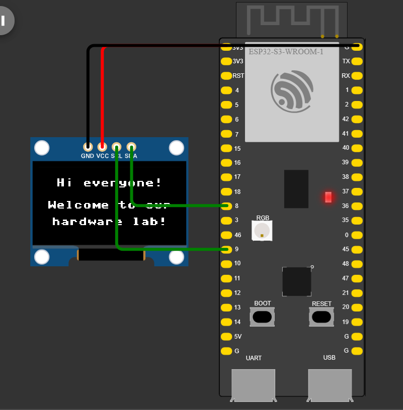
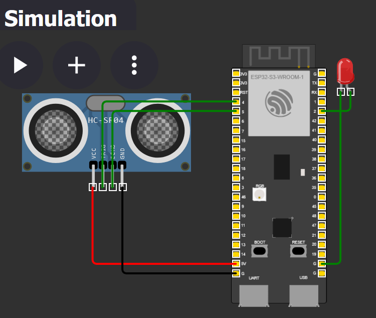
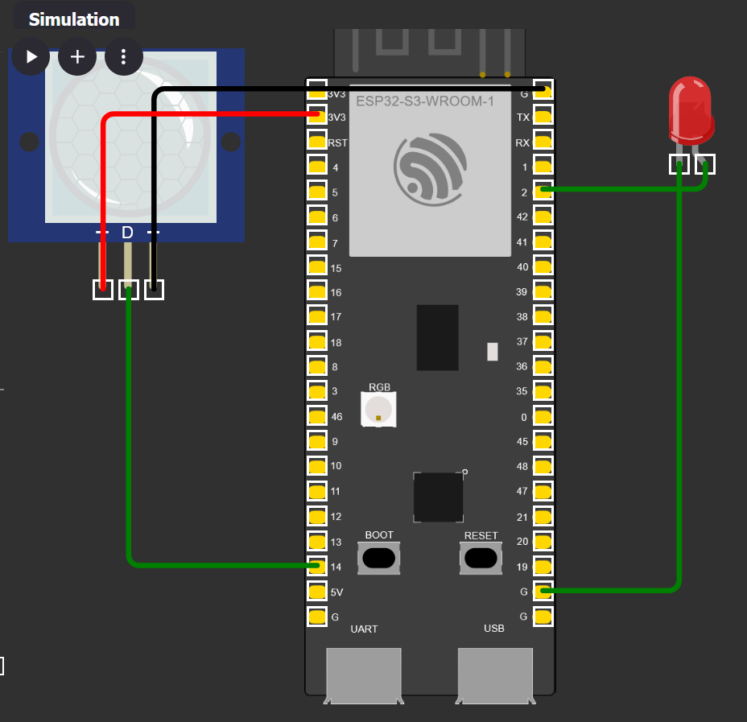
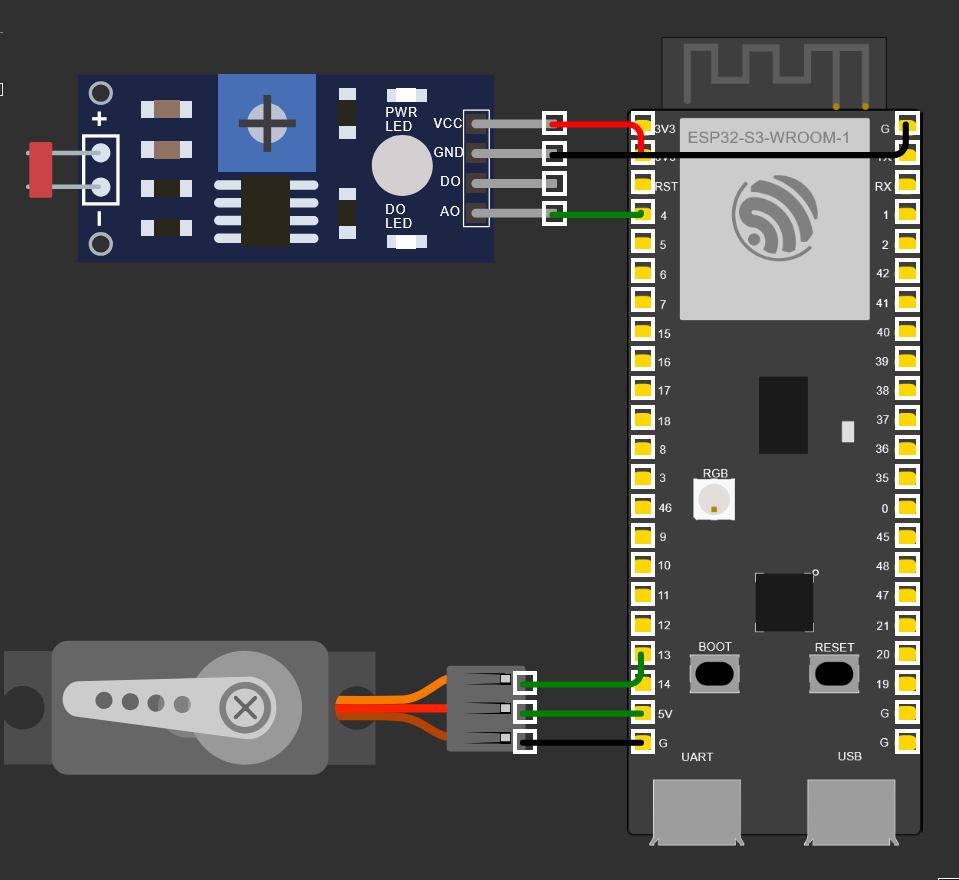

# CATopalian PY ESP32-S3 Tutorials
This tutorials series teaches MicroPython using ESP32-S3!

---

Running Simulations: Go to https://wokwi.com/micropython

Start a New ESP32-S3 project

Upload the .json and .py files to simulate the projects.

---

## [OLED Screen](src/tutorials/ssd1306_oled_screen)

---

## [HC-SR04 Ultrasonic Distance Sensor](src/tutorials/hc-sr04_ultrasonic_distance_sensor)

---

# [PIR Motion Light](src/tutorials/pir_motion_light)

--- 

## [Servo Day or Night](src/tutorials/servo_day_or_night)

---

### How to Download this App
1. Click the green Code Button on this github page
2. Choose Download ZIP
3. Save the Zip File
4. Extract All
5. Open the Python File in VSCode
6. Install Wokwi Extension or
7. Upload the .json and .py files to Wokwi to simulate the cirucit.

---

Happy Scripting :-)

---

//----//  

// Dedicated to God the Father  
// All Rights Reserved Christopher Andrew Topalian Copyright 2000-2026  
// https://github.com/ChristopherTopalian  
// https://github.com/ChristopherAndrewTopalian  
// https://sites.google.com/view/CollegeOfScripting

